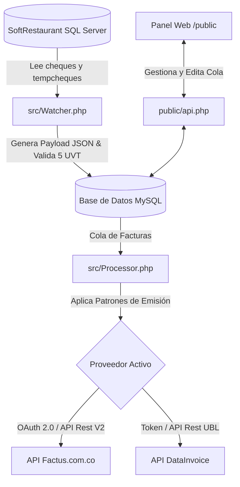

# Middleware de Integración para SoftRestaurant 9.5
### Facturación Electrónica en Tiempo Real con Factus (V2) o DataInvoice (UBL 2.1)

Este sistema actúa como un servicio en segundo plano (daemon) que conecta la base de datos del punto de venta **SoftRestaurant 9.5** con proveedores tecnológicos autorizados por la DIAN en Colombia, automatizando la emisión de facturas electrónicas y optimizando los procesos en caja.

---

## Características principales

El middleware supervisa constantemente las ventas realizadas en SoftRestaurant, procesa la información y la envía de forma automática a la DIAN a través de la API del proveedor configurado (**Factus** o **DataInvoice**), sin interrumpir el flujo operativo de los cajeros.

*   **Multi-Proveedor en Caliente:** Permite alternar la emisión de facturación electrónica entre **Factus (V2)** y **DataInvoice** mediante cambios en el archivo `.env` o desde el panel de administración.
*   **Monitoreo en Tiempo Real (Daemon):** Procesa tickets tanto en estado temporal (`tempcheques`) como histórico (`cheques`), garantizando que ninguna venta quede sin reportar.
*   **Captura Rápida de Identificaciones (Fast-Track POS):** 
    *   Evita el registro de catálogos de clientes complejos en el punto de venta. El cajero solo debe ingresar el NIT o la Cédula del cliente en el campo de **Referencia** o **Comentarios** del cheque al momento de cobrar.
    *   El daemon extrae la identificación, realiza búsquedas automáticas y genera el reporte de facturación cumpliendo con las especificaciones de la DIAN.
*   **Control del Límite de 5 UVT (Consumidor Final):**
    *   Valida dinámicamente el valor actual del UVT en Colombia.
    *   Si una venta a "Consumidor Final" (`222222222222`) supera las **5 UVT**, el middleware bloquea automáticamente el envío y lo coloca en estado **ERROR** con un aviso preventivo.
    *   Permite al administrador asignar los datos del cliente real desde el Dashboard web para liberar y procesar la factura.
*   **Throttling y Patrones de Emisión:**
    *   Configura patrones como `1_OF_2` (envía 1 de cada 2 facturas), `1_OF_3` (1 de cada 3) o `RANDOM_50` (50% de probabilidad de envío) exclusivamente para ventas a Consumidor Final. Las facturas con clientes identificados se envían **siempre**.
*   **Dashboard de Control y Auditoría:**
    *   Interfaz web intuitiva construida en HTML y JS que permite visualizar la cola de facturas.
    *   Filtros detallados por estado (PENDIENTE, EN_COLA, ENVIADO, ERROR, OMITIDA).
    *   Editor en línea para corregir datos del cliente (nombre, email, tipo de documento) de facturas rechazadas o bloqueadas y re-encolarlas de inmediato.
*   **Base de Datos Local de Clientes (Aprendizaje Continuo):**
    *   Almacena información de nuevos clientes detectados para auto-completar datos en futuras ventas si se vuelve a usar la misma identificación.

---

## Arquitectura del Sistema

El proyecto está diseñado bajo una estructura ligera, modular y eficiente en **PHP 8.2+**:



---

## Requisitos del Sistema

*   **PHP:** Versión 8.2 o superior.
*   **Extensiones de PHP requeridas:**
    *   `pdo`, `pdo_mysql` (Para la base de datos de control local).
    *   `sqlsrv`, `pdo_sqlsrv` (Para conectar con SQL Server de SoftRestaurant).
    *   `curl`, `openssl` (Para comunicación con las APIs externas).
*   **Bases de Datos:**
    *   Microsoft SQL Server (Base de datos original de SoftRestaurant).
    *   MySQL / MariaDB (Base de datos del middleware para control de cola).

---

## Guías de Instalación y Despliegue

El middleware admite dos tipos de despliegue principales:

### Opción A: Despliegue Nativo en Servidor Windows con XAMPP (Recomendado)
Esta opción es ideal para servidores de restaurantes físicos que operan sobre Windows. 
1. Instale los controladores PHP oficiales para SQL Server en la carpeta `ext` de su instalación de XAMPP.
2. Copie este repositorio en la carpeta `htdocs/`.
3. Configure el archivo `.env`.
4. Ejecute el demonio en segundo plano configurando el script `src/Daemon.php` en el **Programador de Tareas de Windows** como servicio oculto.

> Para más detalles, consulte la [Guía de Despliegue en XAMPP](file:///d:/Dev/proyectos/SoftRestaurant/xampp_deployment.md).

### Opción B: Despliegue con Docker
Para entornos de desarrollo o servidores virtualizados, dispone de una configuración con Docker Compose.
1. Ejecute el contenedor con:
   ```bash
   docker-compose up -d
   ```
2. El contenedor levantará el servidor web interno en el puerto `8000` y mantendrá ejecutando el proceso `Daemon.php` en segundo plano.

---

## Configuración Inicial (`.env`)

Cree su archivo `.env` en la raíz del proyecto copiando el archivo de ejemplo:

```bash
cp .env.example .env
```

Configure sus credenciales:
*   `DB_*`: Acceso a la base de datos de control local (MySQL).
*   `SR_DB_*`: Credenciales de acceso a la base de datos de SoftRestaurant (SQL Server).
*   `BILLING_PROVIDER`: Define qué API usar por defecto (`factus` o `datainvoice`).
*   `FACTUS_*` / `DATAINVOICE_*`: Credenciales del respectivo proveedor.

---

## Apoyo al Desarrollo (Donaciones)

Si este software le ha sido de utilidad y desea apoyar su mantenimiento y desarrollo de nuevas funciones, puede realizar una contribución voluntaria:

*   **PayPal:** [paypal.me/maurogarcesd](https://paypal.me/maurogarcesd)
*   **Correo electrónico:** `maurogarcesd@gmail.com`

---

## Servicio de Integración y Consultoría

Se ofrece soporte técnico, implementación a medida y acompañamiento para la puesta en marcha de este middleware en restaurantes:

1. **Instalación y Configuración:** Conexión del middleware con la base de datos de SoftRestaurant 9.5 (entornos locales, en red o Docker).
2. **Habilitación ante la DIAN:** Acompañamiento en el proceso de pruebas y paso a producción en la plataforma de la DIAN para Factus o DataInvoice.
3. **Capacitación:** Instrucción al personal de caja y administración sobre el flujo de facturación rápida y el uso del panel de control.
4. **Desarrollo a Medida:** Adaptaciones específicas según los requerimientos contables o de facturación del negocio.

### Datos de Contacto

*   **Responsable:** Mauricio Garcés
*   **Celular / WhatsApp:** [+57 3508902266](https://wa.me/573508902266)
*   **Ubicación:** Colombia 🇨🇴
