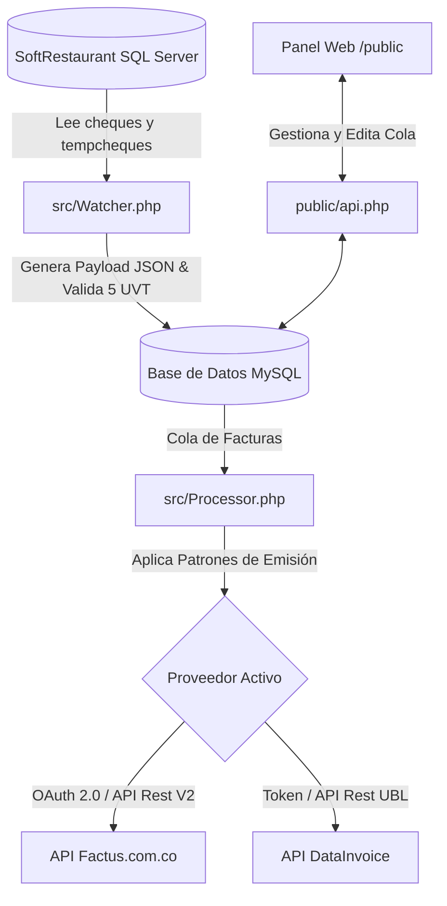

# 🔌 Middleware de Integración para SoftRestaurant 9.5 🚀
### *Facturación Electrónica en Tiempo Real con Factus (V2) o DataInvoice (UBL 2.1)*

Este sistema actúa como un **Middleware / Demonio** inteligente en segundo plano que conecta la base de datos de tu punto de venta **SoftRestaurant 9.5** con proveedores tecnológicos autorizados por la DIAN en Colombia, automatizando la emisión de facturas electrónicas y optimizando los procesos en caja.

---

## 🎯 ¿Qué hace este Middleware?

El middleware supervisa constantemente las ventas realizadas en SoftRestaurant, procesa la información y la envía de forma automática a la DIAN a través de la API del proveedor configurado (**Factus** o **DataInvoice**), todo esto sin interrumpir el flujo operativo de los cajeros.

### 🌟 Características Principales

*   **Multi-Proveedor en Caliente:** Permite alternar la emisión de facturación electrónica entre **Factus (V2)** y **DataInvoice** con un solo cambio en el panel web o el archivo `.env`.
*   **Monitoreo en Tiempo Real (Daemon):** Procesa tickets tanto en estado temporal (`tempcheques`) como en histórico (`cheques`), garantizando que ninguna venta se quede sin procesar.
*   **Captura Rápida de Identificaciones (Fast-Track POS):** 
    *   *Evita crear catálogos de clientes pesados:* El cajero solo debe ingresar el NIT/Cédula del cliente en el campo de **Referencia** o **Comentarios** del cheque al cobrar.
    *   El demonio extrae automáticamente la identificación, consulta si el cliente ya existe en el sistema local o genera un registro rápido que cumple con las especificaciones de la DIAN.
*   **Control del Límite de 5 UVT (Consumidor Final):**
    *   Valida dinámicamente el valor actual del UVT colombiano.
    *   Si una venta a "Consumidor Final" (`222222222222`) supera las **5 UVT**, el middleware bloquea automáticamente el envío, colocándola en estado **ERROR** con un aviso.
    *   Permite al administrador asignar los datos del cliente real desde el Dashboard web para liberar y enviar la factura.
*   **Throttling y Patrones de Emisión Inteligentes:**
    *   Optimiza costos y flujos configurando patrones como `1_OF_2` (envía 1 de cada 2 facturas), `1_OF_3` (1 de cada 3) o `RANDOM_50` (50% de probabilidad de envío) exclusivamente para ventas a Consumidor Final. Las facturas con clientes identificados se envían **siempre**.
*   **Dashboard de Control y Auditoría:**
    *   Interfaz web intuitiva construida en HTML y JS que permite visualizar la cola de facturas.
    *   Filtros por estado (PENDIENTE, EN_COLA, ENVIADO, ERROR, OMITIDA).
    *   Editor en línea para corregir datos del cliente (nombre, email, tipo de documento) de facturas rechazadas o bloqueadas y re-encolarlas con un clic.
*   **Base de Datos Local de Clientes (Aprendizaje Continuo):**
    *   Almacena información de clientes nuevos detectados para auto-completar futuras ventas automáticamente si el cajero vuelve a usar esa identificación.

---

## 🏗️ Arquitectura del Sistema

El proyecto está diseñado bajo una estructura ligera, modular y altamente eficiente en **PHP 8.2+**:



---

## 🛠️ Requisitos del Sistema

*   **PHP:** Versión 8.2 o superior.
*   **Extensiones de PHP obligatorias:**
    *   `pdo`, `pdo_mysql` (Para base de datos local del middleware).
    *   `sqlsrv`, `pdo_sqlsrv` (Para conectar con SQL Server de SoftRestaurant).
    *   `curl`, `openssl` (Para comunicación con las APIs).
*   **Bases de Datos:**
    *   Microsoft SQL Server (Base de datos original de SoftRestaurant).
    *   MySQL / MariaDB (Base de datos del Middleware para la cola).

---

## 🚀 Guías de Instalación y Despliegue

El middleware admite dos tipos de despliegue principales:

### Opción A: Despliegue Nativo en Servidor Windows con XAMPP (Recomendado)
Esta opción es ideal para servidores de restaurantes físicos que corren sobre Windows. 
1. Instala los controladores PHP oficiales para SQL Server en la carpeta `ext` de tu XAMPP.
2. Copia este repositorio en la carpeta `htdocs/`.
3. Configura el archivo `.env`.
4. Ejecuta el Demonio en segundo plano configurando el script `src/Daemon.php` en el **Programador de Tareas de Windows** como servicio oculto.

> 📖 Consulta los pasos detallados en la [Guía de Despliegue en XAMPP](file:///d:/Dev/proyectos/SoftRestaurant/xampp_deployment.md).

### Opción B: Despliegue con Docker
Para entornos de desarrollo o servidores virtualizados, dispones de una configuración con Docker Compose.
1. Ejecuta el contenedor con:
   ```bash
   docker-compose up -d
   ```
2. El contenedor levantará el servidor web interno en el puerto `8000` y mantendrá corriendo el proceso `Daemon.php` en segundo plano.

---

## ⚙️ Configuración Inicial (`.env`)

Crea tu archivo `.env` en la raíz del proyecto copiando el archivo de ejemplo:

```bash
cp .env.example .env
```

Configura tus credenciales:
*   `DB_*`: Acceso a la base de datos de control local (MySQL).
*   `SR_DB_*`: Credenciales de acceso a la base de datos de SoftRestaurant (SQL Server).
*   `BILLING_PROVIDER`: Define qué API usar por defecto (`factus` o `datainvoice`).
*   `FACTUS_*` / `DATAINVOICE_*`: Credenciales del respectivo proveedor.

---

## ☕ Apoya el Proyecto (Donaciones)

Si este software te ha sido de utilidad en tu restaurante o consultoría y deseas apoyar su desarrollo continuo, mantenimiento o la creación de nuevas funciones, ¡puedes invitarnos a un café! ☕

Aceptamos donaciones voluntarias a través de **PayPal**:
*   👉 **Donación vía PayPal:** [paypal.me/maurogarcesd](https://paypal.me/maurogarcesd)
*   📩 **Cuenta de Correo:** `maurogarcesd@gmail.com`

---

## 🧑‍💻 Integración como Servicio de Consultoría
### *¿Necesitas implementar esta solución en tu restaurante o el de tus clientes?*

Este middleware se ofrece como un **Servicio Integral de Integración y Puesta en Marcha**. 

Se incluye:
1.  **Instalación y Configuración:** Conexión segura con tu base de datos de SoftRestaurant 9.5 (Local, Red o Docker).
2.  **Soporte de Habilitación DIAN:** Acompañamiento completo en el proceso de pruebas y habilitación en la plataforma de la DIAN para Factus o DataInvoice.
3.  **Capacitación del Personal:** Instrucción rápida a cajeros y administradores sobre cómo opera el fast-track de identificaciones desde el POS y el uso del Dashboard.
4.  **Garantía y Ajustes Personalizados:** Modificaciones en tarifas de impuestos (IVA, INC), propinas, descuentos u otros requisitos contables específicos de tu negocio.

### 📞 Información de Contacto

Si estás interesado en adquirir el servicio de integración o necesitas soporte técnico especializado:

*   **Responsable:** Mauricio Garcés
*   **Celular / WhatsApp:** [+57 3508902266](https://wa.me/573508902266)
*   **Ubicación:** Colombia 🇨🇴

---
*Desarrollado para ofrecer eficiencia, estabilidad y cumplimiento legal en la facturación electrónica de la industria gastronómica.*
