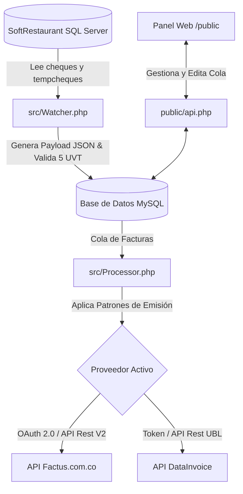

# 🍽️ Soft Restaurant 9.5 — Middleware de Facturación Electrónica DIAN

[](LICENSE)
[](https://www.php.net/)
[](https://www.docker.com/)
[](https://www.dian.gov.co/)
[](https://factus.com.co/)
[](https://www.datainvoice.co/)

> **Middleware PHP de integración entre SoftRestaurant 9.5 y la DIAN (Colombia) para facturación electrónica automática y en tiempo real. Compatible con Factus V2 y DataInvoice UBL 2.1.**

---

## ¿Qué es este proyecto?

Este sistema actúa como un **servicio demonio (daemon)** que conecta la base de datos del punto de venta **SoftRestaurant 9.5** con proveedores tecnológicos autorizados por la **DIAN en Colombia**, automatizando la emisión de **facturas electrónicas** sin interrumpir el flujo operativo de los cajeros.

Ideal para:
- 🏪 Restaurantes colombianos obligados a facturar electrónicamente ante la DIAN
- 🔌 Integradores que necesitan un puente entre SoftRestaurant y la DIAN
- 💻 Desarrolladores que buscan automatizar la facturación en puntos de venta

---

## ✨ Características Principales

| Característica | Descripción |
|---|---|
| 🔄 **Multi-Proveedor** | Alterna entre **Factus V2** y **DataInvoice** desde el panel o el `.env` |
| 🤖 **Daemon en Tiempo Real** | Procesa `tempcheques` y `cheques` sin intervención manual |
| ⚡ **Fast-Track POS** | El cajero ingresa solo el NIT/Cédula en el campo de referencia |
| 📊 **Control 5 UVT** | Valida límites de Consumidor Final automáticamente |
| 🎛️ **Throttling** | Patrones `1_OF_2`, `1_OF_3`, `RANDOM_50` para Consumidor Final |
| 🖥️ **Dashboard Web** | Panel de control con filtros, editor de facturas y gestión de cola |
| 📚 **BD Clientes Local** | Aprende y autocompleta datos de clientes frecuentes |
| 🔁 **Manejo de Errores 409** | Detecta conflictos con la DIAN, elimina y recrea la factura automáticamente |

---

## 🏗️ Arquitectura del Sistema



---

## 🖥️ Capturas de Pantalla

> Panel de control web con monitoreo en tiempo real, filtros por estado y gestión de facturas.

---

## ⚙️ Requisitos del Sistema

- **PHP:** 8.2 o superior
- **Extensiones PHP:** `pdo`, `pdo_mysql`, `sqlsrv`, `pdo_sqlsrv`, `curl`, `openssl`
- **Bases de Datos:**
  - Microsoft SQL Server (base de datos de SoftRestaurant)
  - MySQL / MariaDB (base de control del middleware)
- **Sistema Operativo:** Windows Server / Linux (Docker)

---

## 🚀 Instalación y Despliegue

### Opción A: Windows con XAMPP (Recomendado para restaurantes)

1. Instale los drivers PHP para SQL Server en la carpeta `ext` de XAMPP
2. Clone este repositorio en `htdocs/`
3. Configure el archivo `.env` con sus credenciales
4. Programe `src/Daemon.php` en el **Programador de Tareas de Windows**

> Ver la [Guía completa de despliegue en XAMPP](xampp_deployment.md)

### Opción B: Docker (Desarrollo / Servidores Virtualizados)

```bash
# Clonar el repositorio
git clone https://github.com/maurogarcesd/softrestaurant-facturacion-electronica.git
cd softrestaurant-facturacion-electronica

# Configurar variables de entorno
cp .env.example .env
# Edite .env con sus credenciales

# Levantar el contenedor
docker-compose up -d
```

El contenedor expondrá el dashboard en `http://localhost:8000`

---

## 🔧 Configuración (`.env`)

```bash
cp .env.example .env
```

Variables principales:

```ini
# Base de datos de control (MySQL)
DB_HOST=localhost
DB_NAME=facturas_db
DB_USER=root
DB_PASS=secret

# Base de datos SoftRestaurant (SQL Server)
SR_DB_HOST=192.168.1.100
SR_DB_NAME=SoftRestaurant

# Proveedor activo: "factus" o "datainvoice"
BILLING_PROVIDER=factus

# Credenciales Factus
FACTUS_CLIENT_ID=...
FACTUS_CLIENT_SECRET=...

# Credenciales DataInvoice
DATAINVOICE_TOKEN=...
```

Toda la configuración también puede gestionarse desde el **Panel Web → ⚙️ Configuración**.

---

## 📋 Estados de Facturas

| Estado | Descripción |
|---|---|
| `PENDIENTE` | Detectada, esperando procesamiento |
| `EN_COLA` | En proceso de envío a la DIAN |
| `ENVIADO` | Aceptada exitosamente por la DIAN |
| `ERROR` | Rechazada — requiere corrección manual |
| `OMITIDA` | Excluida por reglas de throttling |

---

## 🔍 Palabras Clave (SEO)

`facturación electrónica Colombia` · `DIAN` · `SoftRestaurant 9.5` · `Factus` · `DataInvoice` · `UBL 2.1` · `middleware facturación` · `punto de venta restaurante` · `factura electrónica PHP` · `integración DIAN Colombia` · `resolución DIAN` · `obligados factura electrónica`

---

## 💰 Apoyo al Desarrollo

Si este software le ha sido útil, puede apoyar su desarrollo:

- **PayPal:** [paypal.me/maurogarcesd](https://paypal.me/maurogarcesd)
- **Correo:** `maurogarcesd@gmail.com`

---

## 🛠️ Servicio de Integración y Consultoría

Ofrecemos soporte técnico, implementación a medida y acompañamiento:

1. **Instalación y Configuración** — Entornos locales, en red o Docker
2. **Habilitación ante la DIAN** — Proceso de pruebas y producción con Factus o DataInvoice
3. **Capacitación** — Al personal de caja y administración
4. **Desarrollo a Medida** — Adaptaciones según requerimientos del negocio

### 📞 Contacto

| Canal | Datos |
|---|---|
| 👤 Responsable | Mauricio Garcés |
| 📱 WhatsApp | [+57 350 890 2266](https://wa.me/573508902266) |
| 🌐 Web | [ksistemas.com](https://ksistemas.com) |
| 📧 Email | maurogarcesd@gmail.com |
| 🇨🇴 Ubicación | Colombia |

---

## 📄 Licencia

Este proyecto está licenciado bajo la [Licencia MIT](LICENSE).

---

*Desarrollado con ❤️ para restaurantes colombianos que necesitan cumplir con la facturación electrónica DIAN de forma simple y automatizada.*
